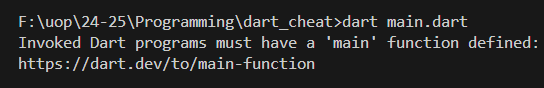
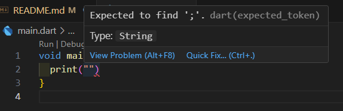
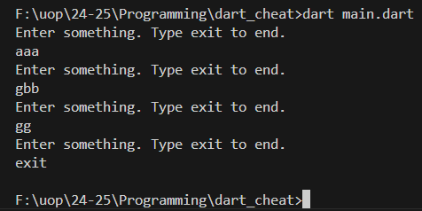

<h1>Dart cheatsheet</h1>
<h2>Data types</h2>
<p>In dart we have the following data types:</p>
<h3>int</h3>
<p>Used for holding negative and positive <b>WHOLE</b> numbers. Cannot be used for fractions.

Syntax:
```dart
int a = 2;
int b = -4;
```
<h3>double</h3>
<p>Used for holding negative and positive <b>fraction</b> numbers.

Syntax:
```dart
double c = 2.4;
double d = -5.745;
double e = 4; // can store whole numbers as well
```

<h3>bool</h3>

Can only hold either `true` or `false`. Unlike in Python, in Dart you <b>CANNOT</b> store `0` or `1` into a bool.

Syntax:
```dart
bool t = true;
bool f = false;

bool thisWontWork = 1; // A value of type 'int' can't be assigned to a variable of type 'bool'
```

<h3>String</h3>

String is used to store a chain of characters. Unlike the rest 3, it has to start with an uppercase `S`. (String is a class, while the others are primitive types)</br>
The text to be stored goes within `""` or `''`. 
```dart
String text = "Hello, world";
String text2 = 'You can use single quotes too!';
```
<h2>Operators</h2>

<ul>
    <li>
        <b>+</b>: add
    </li>
    <li>
        <b>-</b>: subtract
    </li>
    <li>
        <b>*</b>: multiply
    </li>
    <li>
        <b>/</b>: divide
    </li>
    <li>
        <b>%</b>: get remainder from division (5%2 = 1)
    </li>
    <li>
        <b>++</b>: equivalent to +1 (i++ -> i = i+1)
    </li>
    <li>
        <b>--</b>: equivalent to -1 (i-- -> i = i-1)
    </li>
    <li>
        <b>&&</b>: and (logical operator, used for conditions)
    </li>
    <li>
        <b>||</b>: or (logical operator, used for conditions)
    </li>
</ul>

<h2>Language convention & requirements </h2>

<h3>Main function (program entry point)</h3>

Unlike in Python, in Dart you <b>MUST</b> have a main function. That is the entry point to your program. When you run your code, the compiler will look for this main function, and will call it.
The return type of this function must be void. This means, that the main function doesn't return any value after execution.

```dart
void main(){
    print("Hello world");
}
```

Without a main function, your program will fail to run.


<h3>Semicolon</h3>
In Dart, each statement <b>MUST</b> end with a semicolon <code>;</code>. This is <b>NOT</b> optional, and if you forget it, it will result in an error (your program will fail to run).
Your editor (VSCode, IntelliJ) will help you with this with highlighting.

```dart
void main(){
    print("Hello world without semicolons") // Expected to find ';'.
}
```


<h3>Naming convention</h3>
Each programming language has an agreed naming convention. A naming convention is essentially a guideline how to name variables, what to uppercase, whether to use <code>_</code> or not. <br/>
In Python, we use <code>snake_case</code>. However, in Dart, we use <code>camelCase</code>.<br/>
The rules of <code>camelCase</code> is to start with a small letter, then if the variable name contains multiple words, each word must start with a capital letter.<br/>
See examples below.

```dart
int single = 0;
int multipleWordVariable = 4;
String youNeedToStartEachWordWithACapitalLetter = "";
```

<h2>Getting user input</h2>

To get user input from the console, you need to import the io library

```dart
import 'dart:io';
```

Basic String input:
```dart
String? input = stdin.readLineSync();
```

The reason for putting <code>?</code>, is because the user might not enter anything. In that case, the value of <code>input</code> will be <code>null</code>. The <code>?</code> means that the variable <code>input</code> might be a String, but it can also be null.</br>

<h3>Converting user input</h3>
You might want to convert user input(String) to another type, for example integer.</br>

```dart
String? input = stdin.readLineSync();
int? numberInput = int.tryParse(input!);
print(numberInput);
```

The <code>tryParse</code> method will try to convert the <code>input</code> into an int, if it fails it will return null, that's why we declare <code>int?</code>.</br>
Advantage of <code>tryParse</code> over regular <code>parse</code>, that in case the conversion fails (for example users enters words, not number) the program will not crash, but it will return null instead. </br>

The <code>!</code> is used to assure the compiler, that the value of <code>input</code> is not null, because the <code>tryParse</code> method expects a <code>String</code>, not <code>String?</code>(which might be null, but a regular String cannot be null)</br>

<h4>Asking user to input until it succeeds</h4>
You might want to continously ask user to enter a number, until the user enters a number (and not anything else.)</br>

```dart
int getIntegerInput() { // return type is integer
  int? value; // declare an int that might be null
  while (true) { // loop that goes forever
    value = int.tryParse(stdin.readLineSync()!); // read input, then try to convert it to int
    if (value == null) { // check if value is null
      print("Enter a valid integer!"); // after printing, the program will go back to the beginning of while loop
    } else { // if value is not null, the conversion succeeded
      return value; // return the value, which exits the loop
    }
  }
}
```


<h2>Functions</h2>
Functions work similarly as in Python, but uses a different syntax.<br/>
Instead of using colon <code>:</code>, in Dart we define a function body with curly braces <code>{}</code> <br/>

General function syntax:
<code><i>return_type</i> <i>function_name</i>(<i>parameters?</i>){}</code>

A function either returns something, or it doesn't return anything. Look at the examples below: <br/>
<b>Note:</b> A function MUST return the defined return type, otherwise your program will fail to run. So if you define your function as <code>int</code>, but you return a <code>String</code>, it will throw an error.
Also, trying to return a value from a <code>void</code> function will also result in an error.

```dart
void main(){
    int resultOfSum = add(2, 4); // returned values can be stored in a variable
    print(resultOfSum); // prints 6

    greet("John"); // prints "Hello John"
}

int add(int a, int b){ // by starting with int, we define that this function should return an integer
    return a + b; // we return a value with the 'return' keyword. 
}

void greet(String name){ // the 'void' keyword indicates that this function DOES NOT RETURN anything
    print("Hello ${name}");
}
```

Unlike in Python, the order of functions doesn't matter. If you are calling a function that is above or below the code where you are calling it from, will not matter. <br/>
See example below.

<b>Example 1:</b>

```dart
int add(int a, int b){
    return a + b;
}

void main(){
    print(add(2, 4)); // prints 6
}
```

<b>Example 2:</b>

```dart
void main(){
    print(add(2, 4)); // prints 6
    // this also works even though the 'add' function is below the caller
}

int add(int a, int b){
    return a + b;
}
```

<h2>If statements</h2>

<code>if</code> statements are used to check whether a condition is true or false. An if branch will only run, if the given condition evaluates to true.

Syntax:

```dart
int a = 4;
int b = 5;

if(a < b){
    print("a is smaller than b"); // this gets printed, as a(4) is smaller than b(5)
}

```

The condition (here <code>a&lt;b</code>) goes after the <code>if</code> keyword, and within brackets. After that you need to put <code>{}</code>, just like for functions.
The <code>{}</code> defines the body of that <code>if</code> branch.

<h3>else if and else</h3>
You can have multiple conditions within the same if statement.

```dart
int age = 56;

if(age < 18){
    // do something if age is less than 18
}else if(age >= 18 && age < 25){
    // do something if age is between 18(inclusive) and 25(exclusive)
}else{
    // do something in ANY other cases
}
```

<h2>Lists</h2>
Lists can be used to store a collection of values.

Syntax:
```dart
List<int> numbers = [0, 1, 2, 4, 5];
```

Between the <code>&lt;&gt;</code> you need to define the data type (what type of data you want to store). This can be <i>anything</i>.

```dart
List<String> names = ['Sándor', 'Johnson', 'Carl', 'Vladimir'];
List<double> fractions = [1.5, 3.14, 1.669, 5.655];
List<int> marks = [56, 78, 67];
```

<h3>Accessing list elements</h3>
Lists are indexed from <code>0</code>. This means that the first element will be at position <code>[0]</code> , <b>NOT!</b> <code>[1]</code>.

```dart
List<String> names = ['Sándor', 'Johnson', 'Carl', 'Vladimir'];
print(names[0]); // will print Sándor
print(names[3]); // will print Vladimir
```

<h3>List methods and properties<h3>
<h4>Add to a list</h4>
You can add a new element to the list with the <code>add(<i>value</i>)</code> method.

```dart
List<String> names = ['Sándor', 'Johnson', 'Carl', 'Vladimir'];
print(names); //[Sándor, Johnson, Carl, Vladimir]
names.add("Joe"); // note: the data type must match the initial <String> data type
print(names); // [Sándor, Johnson, Carl, Vladimir, Joe]
```

<h4>Remove from a list</h4>
You can remove an element from the list with the <code>remove(<i>value</i>)</code> method. </br>
It will remove the <code>first</code> occurence of the element, <b>NOT</b> all of them.

```dart
List<String> names = ['Sándor', 'Johnson', 'Carl', 'Vladimir'];
print(names); //[Sándor, Johnson, Carl, Vladimir]
names.remove("Johnson"); // note: the data type must match the initial <String> data type
print(names); // [Sándor, Carl, Vladimir, Joe]
```

<h4>Check if an element exists in the list</h4>
Using the <code>contains(<i>value</i>)</code> method, you can check if an element exists in the list or not. It returns <code>true</code> if exists, <code>false</code> if doesn't exist.

```dart
List<String> names = ['Sándor', 'Johnson', 'Carl', 'Vladimir'];
print(names.contains('Carl')); // prints true
```

<h4>Length (size) of a list</h4>
You can check the length of a list with the <code>length</code> property. It will return the number of elements in the list.

```dart
List<String> names = ['Sándor', 'Johnson', 'Carl', 'Vladimir'];
print(names.length); // prints 4
names.remove("Carl");
print(names.length); // prints 3
```

<h2>Loops</h2>
Loops are used to run the same piece of code until a specified condition is true.</br>
We have 3 different types of loops in Dart.
<h3>for loops</h3>

Syntax:

```dart
for(int i =0;i<10;i++){
    print(i); // this will print numbers from 0...9, it will NOT print 10, as the condition 10<10 is FALSE, and 9<10 is the last true condition
}
```

Syntax breakdown:
```dart
int i = 0; // this creates a variable named i, with an initial value 0
i < 10; // this is the condition. This loop will run while i is less than 10
i++ // this means to increment i by 1 after each iteration. This is a shorthand for i = i + 1
```
<b>Note:</b>within the for loop <code>for()</code>, each statement is separated by a semicolon <code>;</code>. </br>
<b>Note 2:</b> the variable name <code>i</code> is just a convention for programmers that is often used as a for loop variable, you can name it for example index if you want, or elephant (don't). </br>
<b>Note 3:</b> the third statement can be anything you want, for example multiply i by 2 <code>i = i * 2</code> </br>
<b>Note 4:</b> the condition can be <i>almost</i> anything you want. Examples: </br>

```dart
i < 10
i > 5
i <= 25
i >= 40
```

If you wanted to count down from 10 to 1:

```dart
for(int i = 10; i >= 1; i--){
    print(i); // will print numbers from 10...1
}
```

<h4>Looping through lists</h3>
We can use for loops to iterate over a list. The loop goes until it reaches the length of the list, then it exits the loop.</br>

```dart
List<String> names = ['Sándor', 'János', 'Mátyás', 'John'];
for(int i = 0; i<names.length;i++){
    print(names[i]);
}

```

<h3>for-in loops</h3>
For-in loops are similar to Python's for loops. </br>
It can iterate over a collection of elements without needing an index.</br>
The first variable <b>need</b> to match the type of the elements in the list.</br>
The variable <code>name</code> stores the current value from <code>names</code> in each iteration.</br>

```dart
List<String> names = ['Sándor', 'Johnson', 'Carl', 'Vladimir'];
for(String name in names){
    print(name);
}
```

<h3>while loops</h3>
<code>while</code> loops can be used to run until a certain condition is true.</br>
It is useful when the number of iterations are not known (like in <code>for</code> loops).

The above example will ask for user input until the user types <code>exit</code>. A <code>while</code> loop is appropriate, because we do not know when the user will type exit.

```dart
String? input;
while(input != "exit"){
    print("Enter something. Type exit to end.");
    input = stdin.readLineSync();
}
```

